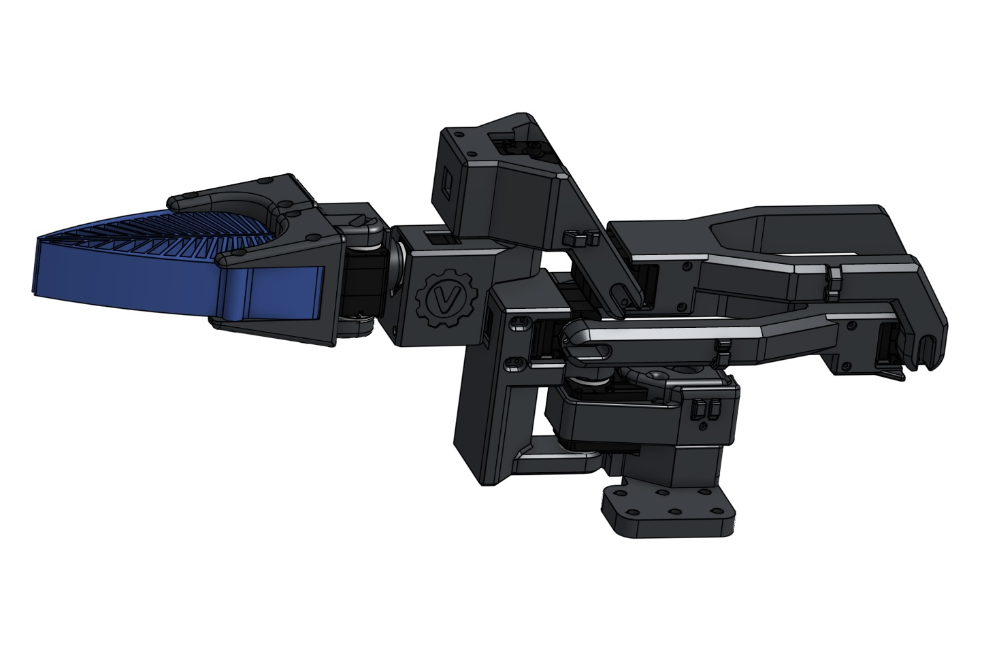

### Mechanicals

- Onshape CAD model (assembly and all part studios): [Open in Onshape](https://cad.onshape.com/documents/86c64a14309d3dc486db1708/w/d43f2d0114135ce97afe233c/e/20c7a3e319bf2e2af5a60a9c?renderMode=0&uiState=68ade1e1922c3160368bf682)
- All mechanical parts are intended to be 3D printed.

### Parts (12 total)

- Shared by both Leader and Follower (7):
  - Base
  - Base-Sleeve
  - L12
  - L23
  - L34
  - L45
  - L56

- Leader-only (2):
  - Handle
  - LeaderGrip

- Follower-only (3):
  - CompliantGripper
  - GripperHolder_Moving
  - GripperHolder_Stationary

### Bill of Materials (additions)

- Torsion spring for Leader Handle — shortened spring from kit: [Amazon torsion spring kit](https://www.amazon.com/dp/B0F9PLNYYF?ref=ppx_yo2ov_dt_b_fed_asin_title). Dimensions: 1.8 mm wire diameter, 14 mm OD coil, 35 mm arm length, 90° angle between arms. The kit includes 4 of the required springs.
- Follower Gripper filament — TPU (Bambu TPU 95A HF): [Product page](https://us.store.bambulab.com/products/tpu-95a-hf?srsltid=AfmBOoqnEimr4z9msv1jPEgGg1KbVxdwoLSTeLrKnNZtwoZR6F3UUzg3&id=41469410607240).

### Assembly reference

- The assembly is analogous to the SO-101. High-quality instructions are available here: [SO-101 assembly guide](https://huggingface.co/docs/lerobot/so101).
