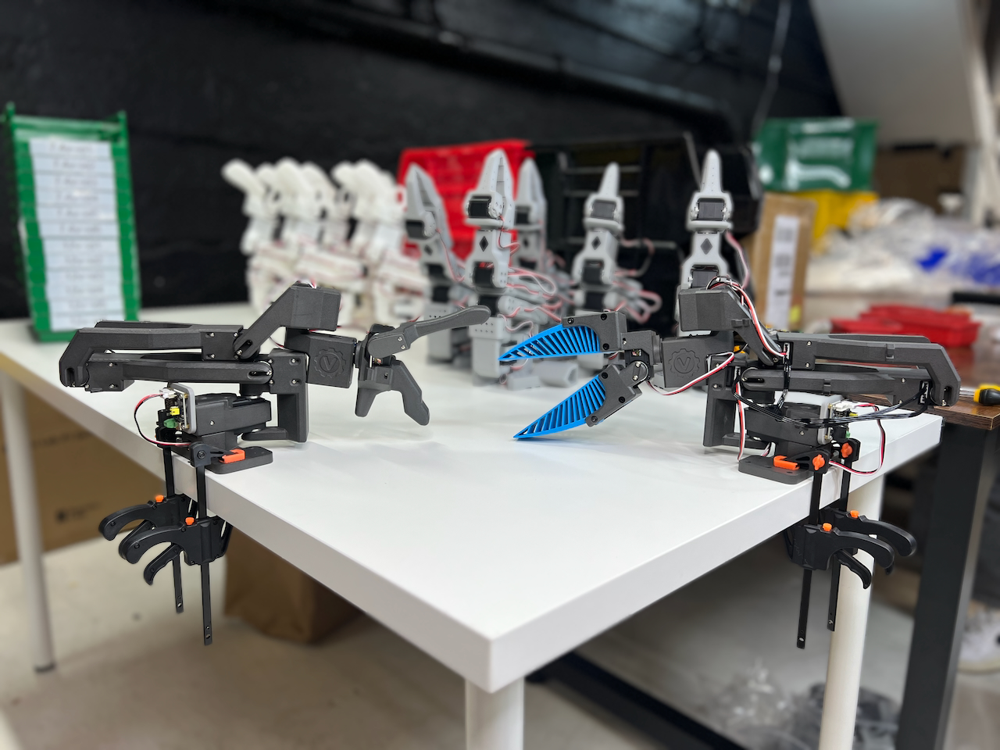

# Shoebill Leader & Follower Robotic Arms

An open source leader-follower robotic arm system with 7 degrees of freedom, made by Vassar Robotics - inspired by GELLO kinematics, compatible with LeRobot software and common arms in the market (ARX, Trossen, I2RT, etc.)

## Overview

**Shoebill is a leader-follower robotic arm system featuring:**

* **7 DoF articulated movement** with FeeTech servo motors
* **Leader/Follower teleoperation** with 1:1 joint mapping
* **Force feedback capability** via torque position setting
* **LeRobot compatibility** for ACT training policy infrastructure
* **Open source SDK** with pip-installable Vassar-FeeTech servo SDK

*Click the image above to watch a Dual Leader set-up (with ARX R5 arms) - Shoebill Robotic Arms Demo*

## Build Guide

### Build Process

1. **[Materials and Components](/mechanicals/mechanicals_readme.md)** - List of materials used
2. **[CAD Files](/mechanicals/)** - OnShape Link, STEP files
3. **[Servo Setup](https://github.com/vassar-robotics/feetech-servo-sdk)** - Configure FeeTech HLS3625 Servos
4. **[Teleoperation Setup](/software/)** - Calibration + Software

### Quick Reference

* **[Bill of Materials](/mechanicals/mechanicals_readme.md)**: Quick overview of materials needed to complete this project
* **[OnShape Link](https://cad.onshape.com/documents/86c64a14309d3dc486db1708/w/d43f2d0114135ce97afe233c/e/5991fe5d18780685a3cfd26c?renderMode=0&uiState=68ade84d922c3160368c08fd)**: 3D Print files also available in `/mechanicals/` directory 
* **[Vassar-FeeTech SDK Repository](https://github.com/vassar-robotics/feetech-servo-sdk)**: Use this to configure servos

## Key Features

### Leader Arm
* **GELLO-Inspired Leader Arm Design** - Follows identical kinematics as ARX, Trossen, and I2RT follower arms
* **Custom Torsion-Spring Gripper** - Easy-to-use, normally-open design
* **FeeTech HLS3625 Servos** - Torque position setting capability for force-feedback paradigms

### Follower Arm
* **UMI-Inspired End Effector** - Compliant TPU material for higher dexterity
* **7 Degrees of Freedom** - More closely mimics human joint structure than 6 DoF
* **12V FeeTech Servos** - 3 N·m output torque for more robust performance

## General Resources
* [Vassar Robotics Shop](https://shop.vassarrobotics.com/)
* [LeRobot Documentation](https://huggingface.co/docs/lerobot/en/installation)

## License

_This project is licensed under the MIT License - see the [LICENSE](LICENSE) file for details._ 